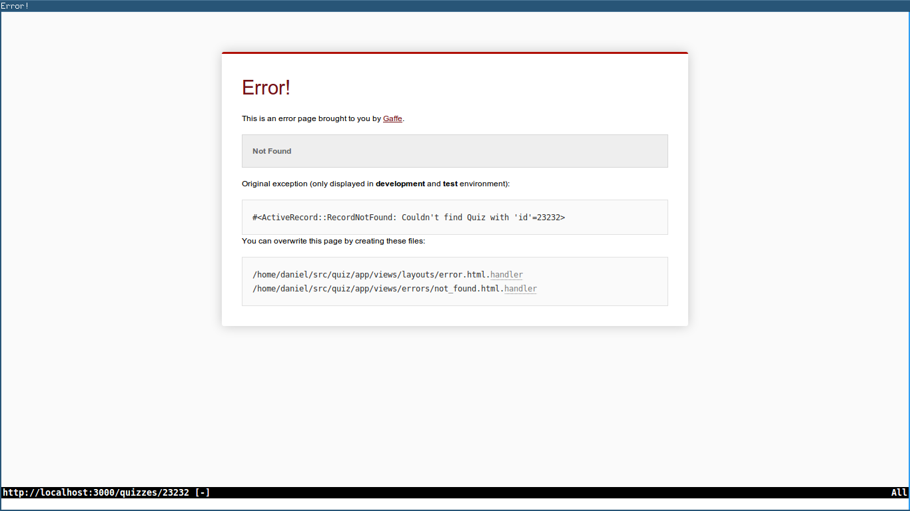

## Use of Github and pushing the initial application

I generated the Rails application using

    rails new quiz

And a basic controller for a placeholder welcome page:

    cd rails
    bin/rails generate controller welcome index 
    
I created a git repository on my Github account to store the project: https://github.com/sandeel/humble-quiz-app
    
I then initialised a git repository

    git init

And added the remote origin

    git remote add origin git@github.com:sandeel/humble-quiz-app.git
    
I then pushed my initial project to github

    git add -A
    git commit -m "Initial commit"
    git push -u origin master

## Database architecture: Models and Migrations

Ruby's `rake` command was used to generate the models for the application.

Examples:

    bin/rails generate model Quiz title:string                          
    
to create a model for a quiz. It consists of only a title because the rest of a
quiz is composed of other entities, eg. Question, Attempt.

    bin/rails generate model Question text:string quiz:references
    
for creating a Question which represents a quiz question with text for the question
text.

    bin/rails generate model Attempt quiz:references result:integer

for creating a model for Attempt which represents an attempt at a quiz. The model
contains a foreign key to the quiz the attempt is on and an integer representing
the score the user got on the quiz.

Migrations were used to modify existing models as so:

    bin/rails g migration AddCorrectAnswerToQuestions correct_answer:int
    
This modified the Question model to add an extra field for the correct answer
to the question.

      bin/rails g migration AddDifficultyToQuizzes difficulty:int        
      
This added a difficulty variable to the quiz model.

    bin/rake db:migrate

## Custom gems

I created two custom gems for use in my application.

The gems were created by writing a `gemspec` file and running `gem build`. This created a gem which I installed on my local machine using `gem install`. To use the gem in my Rails application, I included the lines `gem 'quiz-score-calculator'` and `gem 'next-quiz-generator'` in my Rails Gemfile.

### NextQuizGenerator
This gem contains the algorithm for generating the next set of questions for the user,
based on their level of learning so far.

Here is how the algorithm works in the gem:

    def self.getNextQuiz(users_previous_attempts, available_quizzes)              
                                                                                   
       ## if the user hasn't done more than three quizzes just give them           
       ## the first three quizzes in order to get an idea of their level           
                                                                                   
       if users_previous_attempts.count <= 3                                       
         return available_quizzes.find(users_previous_attempts.count)              
       end                                                                         
                                                                                   
                                                                                   
       ## after the user has done more than three quizzes                          
       ## get an average of their scores so far                                    
                                                                                   
       scores_so_far = []                                                          
       for attempt in users_previous_attempts                                      
           if attempt.result                                                       
               scores_so_far.push(attempt.result)                                  
           end                                                                     
       end                                                                         
                                                                                   
       average_score_based_on_attempts =  (scores_so_far.sum / scores_so_far.size.to_f)
                                                                                   
                                                                                   
       ## sort the quizzes in descending orfer of difficulty and                   
       ## iterate through them until we find one matching the user's level         
                                                                                   
       for quiz in available_quizzes.order('difficulty DESC')                      
           if quiz.difficulty < average_score_based_on_attempts                    
               return quiz                                                         
           end                                                                     
       end                                                                         
                                                                                   
                                                                                   
       ## if all else fails just return the first quiz                             
                                                                                   
       return available_quizzes.find(1)                                            
     end                                                                           
    end 

### QuizScoreCalculator
The calculation of the percentage result on a quiz is contained in a separate gem called QuizScoreCalculator.

The gem contains a class called QuizScoreCalculator with a method which takes two parameters: a set of questions and a set of answers. It calculates the percentage of correct answers given.

Example use of the gem in the main application:

    require 'quiz-score-calculator'

    QuizScoreCalculator.getResult(the_questions, the_answers_given)

## External Gems
### Gaffe
Gaffe was used to generate custom error pages for Rails. More details on this below.

## Custom error handling pages

Gaffe was installed on my machine using

    sudo gem install gaffe

Gaffe was then added to the project by adding the following line to the Gemfile:

    gem 'gaffe'
    
Gaffe was then added to initializers by creating a file called gaffe.rb in 
config/initializers with the following content:

    Gaffe.enable!
    
To allow me to test the error pages in development mode I had to edit
`config/environments/test.rb` and change the option `config.consider_all_requests_local`
to `true`.

The following is an example of an error page generated by Gaffe. To get an error
page, simple try to navigate to a quiz with an id which doesn't exist (see figure 1.)

## Deployment to Heroku

